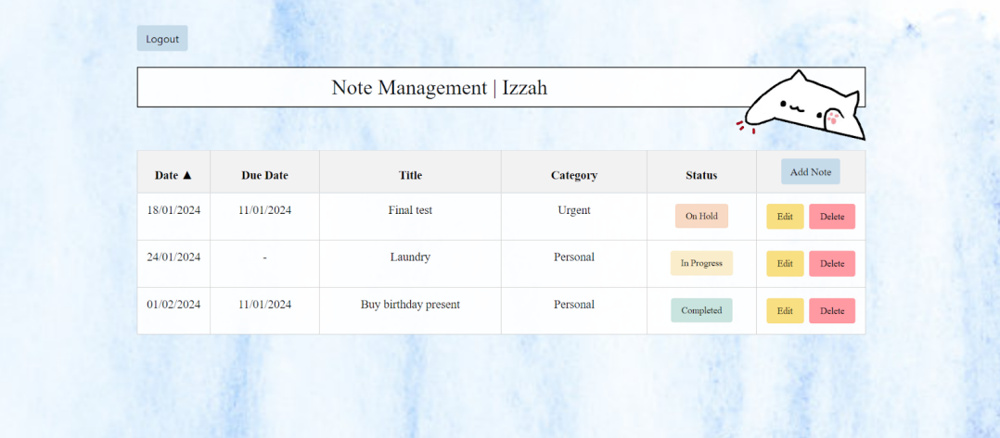
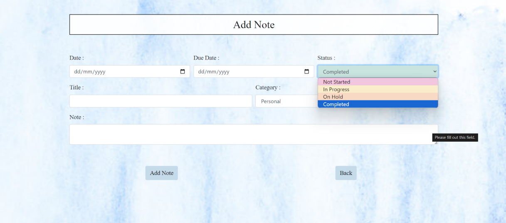
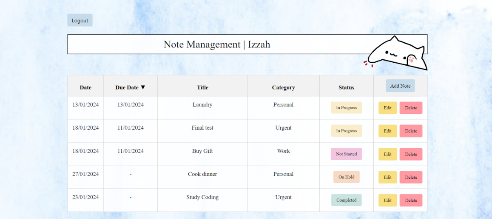
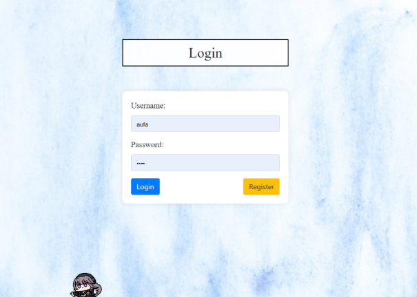
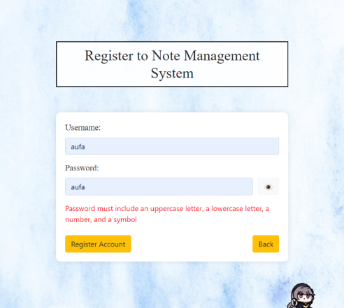

  

# Note Management System
 Web application that allows users to create, organize, and manage their personal notes.

## Features 🌟

- **Task Creation**: Add new tasks with details, categories, and due dates. 📝
- **Task Listing**: View all your tasks in an organized list, with the ability to sort and filter. 📋
- **Task Deletion**: Delete tasks that are no longer needed, with a confirmation dialog. 🗑️
- **Task Management**: Mark tasks as completed, edit task details, or reopen completed tasks. ✅

## Technologies Used 🛠️

- **HTML**: Used for the structure and content of the web pages.📄
- **CSS**: Used for the styling and presentation of the web pages.🎨
- **PHP**: Used for the server-side programming and handling of dynamic functionality.🖥️
- **MySQL**: Used as the database management system for storing and retrieving data.🗄️

## Web Preview 📸

Here are some previews of the website: 

  
